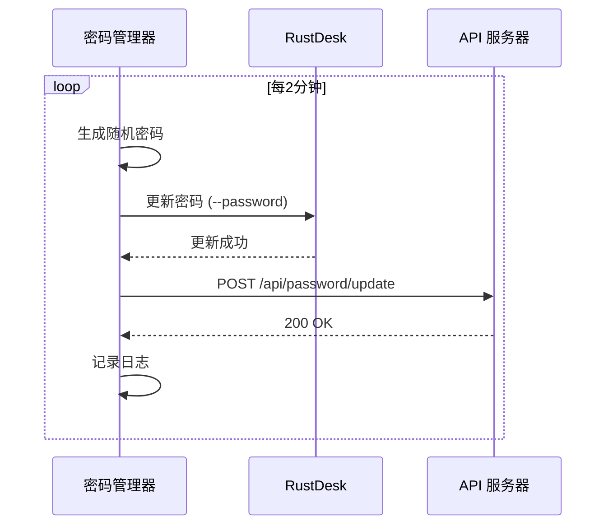

# RustDesk 密码动态管理方案

## 📋 方案说明

采用**第三方程序**方式管理 RustDesk 密码，具有以下优势：

### ✅ 核心优势

| 特性 | 说明 |
|------|------|
| 🔒 **安全性高** | API 密钥与 RustDesk 隔离，防止泄露 |
| 🔧 **易维护** | 配置修改无需重新编译 |
| 🚀 **灵活性强** | 可随时调整策略和频率 |
| 🛡️ **故障隔离** | 密码管理器崩溃不影响 RustDesk 运行 |
| ⬆️ **易升级** | RustDesk 升级不影响密码管理逻辑 |

---

## 🏗️ 架构设计

```
┌─────────────────────────────────────┐
│   password_manager_daemon.py        │
│   (Python 守护进程)                  │
├─────────────────────────────────────┤
│ 1. 每 N 分钟生成随机密码              │
│ 2. 通过命令行更新 RustDesk 密码       │
│ 3. 上报密码到 API 服务器              │
│ 4. 日志记录和错误重试                │
└─────────────────────────────────────┘
              ↓
    通过命令行接口 (--password)
              ↓
┌─────────────────────────────────────┐
│          RustDesk                   │
│  (CQNT远程助手 Sciter版本)           │
└─────────────────────────────────────┘
              ↓
    密码存储在配置文件
              ↓
┌─────────────────────────────────────┐
│      %APPDATA%\RustDesk\            │
│      config\RustDesk2.toml          │
└─────────────────────────────────────┘
```

---

## 🚀 快速开始

### 1. 安装依赖

```bash
pip install requests
```

### 2. 配置文件

首次运行会自动生成 `password_manager_config.json`：

```json
{
  "api_url": "https://your-api-server.com/api/password/update",
  "api_key": "your-secret-api-key",
  "device_id": "",
  "interval_seconds": 120,
  "password_length": 12,
  "retry_times": 3,
  "retry_delay": 5,
  "rustdesk_exe": "rustdesk.exe"
}
```

### 3. 配置说明

| 参数 | 说明 | 默认值 |
|------|------|--------|
| `api_url` | API 服务器地址 | - |
| `api_key` | API 认证密钥 | - |
| `device_id` | 设备标识（自动获取 RustDesk ID） | 自动 |
| `interval_seconds` | 更新间隔（秒） | 120 |
| `password_length` | 密码长度 | 12 |
| `retry_times` | API 重试次数 | 3 |
| `retry_delay` | 重试间隔（秒） | 5 |
| `rustdesk_exe` | RustDesk 可执行文件路径 | rustdesk.exe |

### 4. 运行守护进程

```bash
# Windows
python password_manager_daemon.py

# Linux/Mac
python3 password_manager_daemon.py
```

### 5. 后台运行（Windows 服务方式）

```powershell
# 使用 NSSM 创建 Windows 服务
nssm install RustDeskPasswordManager "C:\Python39\python.exe" "C:\path\to\password_manager_daemon.py"
nssm set RustDeskPasswordManager AppDirectory "C:\path\to"
nssm start RustDeskPasswordManager
```

---

## 📊 工作流程



---

## 🔧 RustDesk 命令行接口

需要确保 RustDesk 支持以下命令行参数：

```bash
# 获取 RustDesk ID
rustdesk.exe --get-id

# 设置密码
rustdesk.exe --password <new_password>
```

如果当前版本不支持，需要添加命令行参数处理。

---

## 🌐 API 服务器接口规范

### 请求

```http
POST /api/password/update HTTP/1.1
Host: your-api-server.com
Authorization: Bearer your-secret-api-key
Content-Type: application/json

{
  "device_id": "123456789",
  "password": "Abc123!@#XYZ",
  "timestamp": "2025-11-17T18:00:00",
  "version": "1.0"
}
```

### 响应

```json
{
  "success": true,
  "message": "密码已更新",
  "device_id": "123456789",
  "updated_at": "2025-11-17T18:00:00"
}
```

---

## 📝 日志示例

```
2025-11-17 18:00:00 - INFO - ============================================================
2025-11-17 18:00:00 - INFO - RustDesk 密码管理守护进程启动
2025-11-17 18:00:00 - INFO - ============================================================
2025-11-17 18:00:00 - INFO - Device ID: 123456789
2025-11-17 18:00:00 - INFO - 更新间隔: 120 秒
2025-11-17 18:00:00 - INFO - API 服务器: https://api.example.com/api/password/update
2025-11-17 18:00:00 - INFO - 密码长度: 12
2025-11-17 18:00:00 - INFO - ============================================================
2025-11-17 18:00:00 - INFO - 开始密码更新周期 - 2025-11-17 18:00:00
2025-11-17 18:00:00 - INFO - ✓ RustDesk 密码更新成功
2025-11-17 18:00:01 - INFO - 正在上报密码到 API 服务器 (尝试 1/3)...
2025-11-17 18:00:01 - INFO - ✓ 密码上报成功: {'success': True}
2025-11-17 18:00:01 - INFO - ✓ 密码更新周期完成
2025-11-17 18:00:01 - INFO - 下次更新时间: 18:02:01
```

---

## ⚠️ 注意事项

### 安全建议

1. **API 密钥保护**
   - 不要将 `api_key` 提交到版本控制
   - 使用环境变量或密钥管理服务
   - 定期轮换 API 密钥

2. **网络安全**
   - 使用 HTTPS 加密传输
   - 实现 IP 白名单
   - 添加请求签名验证

3. **密码策略**
   - 密码长度建议 ≥ 12 位
   - 包含大小写字母、数字、特殊字符
   - 避免使用弱密码

### 故障处理

1. **RustDesk 更新失败**
   - 检查 RustDesk 是否运行
   - 检查命令行参数是否支持
   - 查看 RustDesk 日志

2. **API 上报失败**
   - 检查网络连接
   - 验证 API 密钥
   - 查看 API 服务器日志

3. **守护进程崩溃**
   - 查看 `password_manager.log`
   - 使用进程监控工具自动重启
   - 配置告警通知

---

## 🔄 与源码修改方案对比

| 对比项 | 第三方程序（推荐） | 修改源码 |
|--------|------------------|---------|
| 安全性 | ✅ API密钥隔离 | ⚠️ 硬编码风险 |
| 维护性 | ✅ 配置即改 | ❌ 需重新编译 |
| 灵活性 | ✅ 随时调整 | ❌ 修改困难 |
| 升级 | ✅ 独立升级 | ❌ 需要 merge |
| 调试 | ✅ 独立调试 | ❌ 全量编译 |
| 故障隔离 | ✅ 互不影响 | ⚠️ 耦合紧密 |
| 部署 | ✅ 简单 | ❌ 复杂 |

---

## 🎯 扩展功能

可以轻松添加以下功能：

1. **多设备管理**
   ```python
   # 支持管理多台 RustDesk 设备
   devices = [
       {"id": "123", "exe": "rustdesk1.exe"},
       {"id": "456", "exe": "rustdesk2.exe"}
   ]
   ```

2. **密码策略**
   ```python
   # 自定义密码生成规则
   - 纯数字密码
   - 固定前缀/后缀
   - 基于时间戳的密码
   ```

3. **监控告警**
   ```python
   # 集成告警系统
   - 更新失败发送邮件
   - 集成 Slack/钉钉通知
   - 监控面板展示
   ```

4. **密码历史**
   ```python
   # 保存密码变更历史
   password_history = [
       {"time": "2025-11-17 18:00:00", "password": "***"}
   ]
   ```

---

## 📞 技术支持

如有问题，请查看：

- 日志文件: `password_manager.log`
- 配置文件: `password_manager_config.json`
- RustDesk 配置: `%APPDATA%\RustDesk\config\RustDesk2.toml`

---

## 🚀 下一步

1. ✅ 部署密码管理守护进程
2. ✅ 配置 API 服务器接口
3. ✅ 测试密码更新流程
4. ✅ 配置为 Windows 服务（开机自启）
5. ✅ 添加监控和告警
